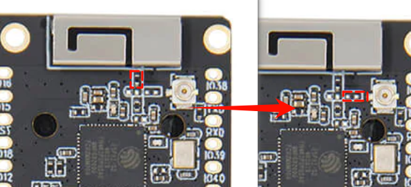
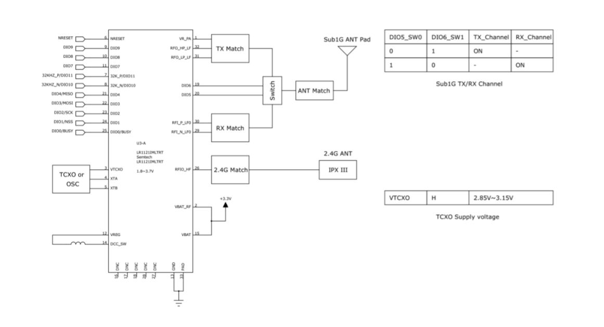

  

<h1 align = "center">🌟LilyGo T3 S3 LR1121🌟</h1>

## Overview

* This page introduces the hardware parameters related to `LilyGo T3 S3 LR1121`

### Notes on use

1. This version does not have BMS, please use a lithium-ion battery with battery protection function
2. Please be sure to connect the antenna before transmitting, otherwise it is easy to damage the RF module

### Product

| Product    | SOC           | Flash         | PSRAM         |
| ---------- | ------------- | ------------- | ------------- |
| [T3-S3][1] | ESP32-S3FH4R2 | 4MB(Quad-SPI) | 2MB(Quad-SPI) |

[1]: https://www.lilygo.cc/products/t3s3-v1-0?variant=42586879688885 "T3-S3"

## PlatformIO Quick Start

1. Install [Visual Studio Code](https://code.visualstudio.com/) and [Python](https://www.python.org/)
2. Search for the `PlatformIO` plugin in the `Visual Studio Code` extension and install it.
3. After the installation is complete, you need to restart `Visual Studio Code`
4. After restarting `Visual Studio Code`, select `File` in the upper left corner of `Visual Studio Code` -> `Open Folder` -> select the `LilyGo-LoRa-Series` directory
5. Wait for the installation of third-party dependent libraries to complete
6. Click on the `platformio.ini` file, and in the `platformio` column
7. Select the board name you want to use in `default_envs` and uncomment it.
8. Uncomment one of the lines `src_dir = xxxx` to make sure only one line works , Please note the example comments, indicating what works and what does not.
9. Click the (✔) symbol in the lower left corner to compile
10. Connect the board to the computer USB-C , Micro-USB is used for module firmware upgrade
11. Click (→) to upload firmware
12. Click (plug symbol) to monitor serial output
13. If it cannot be written, or the USB device keeps flashing, please check the **FAQ** below

## Arduino IDE quick start

1. Install [Arduino IDE](https://www.arduino.cc/en/software)
2. Install [Arduino ESP32](https://docs.espressif.com/projects/arduino-esp32/en/latest/)
3. Copy all folders in the `lib` directory to the `Sketchbook location` directory. How to find the location of your own libraries, [please see here](https://support.arduino.cc/hc/en-us/articles/4415103213714-Find-sketches-libraries-board-cores-and-other-files-on-your-computer)
    * Windows: `C:\Users\{username}\Documents\Arduino`
    * macOS: `/Users/{username}/Documents/Arduino`
    * Linux: `/home/{username}/Arduino`
4. Open the corresponding example
    * Open the downloaded `LilyGo-LoRa-Series`
    * Open `examples`
    * Select the sample file and open the file ending with `ino`
5. On Arduino ISelect the corresponding board in the DE tool project and click on the corresponding option in the list below to select

    | Name                                 | Value                                                |
    | ------------------------------------ | ---------------------------------------------------- |
    | Board                                | **LilyGo T3-S3**                                     |
    | Port                                 | Your port                                            |
    | USB CDC On Boot                      | Enable                                               |
    | CPU Frequency                        | 240MHZ(WiFi)                                         |
    | Core Debug Level                     | None                                                 |
    | USB DFU On Boot                      | Disable                                              |
    | Erase All Flash Before Sketch Upload | Disable                                              |
    | Events Run On                        | Core1                                                |
    | Arduino Runs On                      | Core1                                                |
    | USB Firmware MSC On Boot             | Disable                                              |
    | Partition Scheme                     | **Default 4MB with spiffs (1.2MB APP/1.5MB SPIFFS)** |
    | PSRAM                                | **QSPI PSRAM**                                       |
    | **Board Revision***                  | **Radio-LR1121**                                     |
    | Upload Mode                          | **UART0/Hardware CDC**                               |
    | Upload Speed                         | 921600                                               |
    | USB Mode                             | **CDC and JTAG**                                     |
    | Programmer                           | **Esptool**                                          |

     * **Board revision Select according to actual model**

6. Upload sketch

### 📍 Pins Map

| Name                   | GPIO NUM                  | Free |
| ---------------------- | ------------------------- | ---- |
| (QWIIC) Uart1 TX       | 43(External QWIIC Socket) | ✅️    |
| (QWIIC) Uart1 RX       | 44(External QWIIC Socket) | ✅️    |
| QWIIC Socket IO10*     | 10(External QWIIC Socket) | ✅️    |
| QWIIC Socket IO21*     | 21(External QWIIC Socket) | ✅️    |
| SDA                    | 18                        | ❌    |
| SCL                    | 17                        | ❌    |
| OLED(**SSD1306**) SDA  | Share with I2C bus        | ❌    |
| OLED(**SSD1306**) SCL  | Share with I2C bus        | ❌    |
| SD CS                  | 13                        | ❌    |
| SD MOSI                | 11                        | ❌    |
| SD MISO                | 2                         | ❌    |
| SD SCK                 | 14                        | ❌    |
| LoRa(**LR1121**) SCK   | 5                         | ❌    |
| LoRa(**LR1121**) MISO  | 3                         | ❌    |
| LoRa(**LR1121**) MOSI  | 6                         | ❌    |
| LoRa(**LR1121**) RESET | 8                         | ❌    |
| LoRa(**LR1121**) DIO9  | 36                        | ❌    |
| LoRa(**LR1121**) BUSY  | 34                        | ❌    |
| LoRa(**LR1121**) CS    | 7                         | ❌    |
| Button1 (BOOT)         | 0                         | ❌    |
| Battery ADC            | 1                         | ❌    |
| On Board LED           | 37                        | ❌    |

* You can use GPIO10,21 by removing the two resistors in the figure below. Otherwise, the GPIO is connected to DIO8,DIO7 of Radio by default.

### 🧑🏼‍🔧 I2C Devices Address

| Devices              | 7-Bit Address | Share Bus |
| -------------------- | ------------- | --------- |
| OLED Display SSD1306 | 0x3C          | ✅️         |

### ⚡ Electrical parameters

| Features                           | Details  |
| ---------------------------------- | -------- |
| 🔗USB-C Input Voltage               | 5V       |
| 🔗Solar Input Voltage(T3 V1.3 Only) | 4.5~5.6V |
| ⚡Charge Current                    | 500mA    |
| 🔋Battery Voltage                   | 3.7V     |

> \[!IMPORTANT]
> T3 V1.3 The maximum solar input voltage can only be 5.6V. If the voltage exceeds this, the Zener diode will discharge and cause the diode to heat up.T3 V1.3 
>

### Button Description

| Channel | Peripherals                    |
| ------- | ------------------------------ |
| BOOT    | Boot mode button, customizable |
| RST     | Reset button                   |

### LED Description

* CHG LED

| LED State | Details               |
| --------- | --------------------- |
| On        | Battery charging      |
| Off       | Battery Full          |
| Blink     | Battery not connected |

* User LED

1. The LED is connected to ESP32 GPIO37, and the LED is turned on or off by writing a high or low level

### RF parameters

| Features                  | Details                            |
| ------------------------- | ---------------------------------- |
| RF  Module                | LR1121                             |
| Frequency range           | 400-520MHz/830-945MHz/2400-2500MHz |
| Transfer rate(LoRa Sub1G) | 0.018 K ～ 62.5 Kbps               |
| Transfer rate(FSK Sub1G)  | 0.6 K ～ 300 Kbps                  |
| Transfer rate(LoRa 2.4G)  | 0.476 K~101.5 Kbps                 |
| Modulation                | LoRa,FSK,LR-HFSS                   |

## WiFi-IPEX

* The following figure shows how to switch the onboard WIFI antenna to IPEX

## LoRa-IPEX

* The following figure shows how to switch the onboard LoRa SMA antenna to IPEX

### LR1121 RF Block Diagram

#### Resource

* [T3_S3_V1.2 schematic](../../../schematic/T3_S3_V1.2.pdf)
* [T3_S3_V1.3 schematic](../../../schematic/T3_S3_V1.3.pdf)
* [LR1121 datasheet](https://www.semtech.com/products/wireless-rf/lora-connect/lr1121)

### Application

* [T-Beam Meshtastic](https://github.com/meshtastic/Meshtastic-device)
